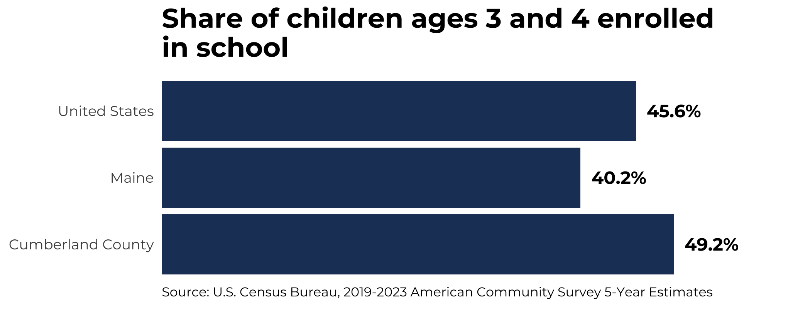

---
output:
  html_document:
    toc: true
    toc_float: true
    theme: united
    
---
<h1>Preschool Enrollment Data</h1>
This script loads, analyzes and charts American Census 5 Year Estimates on preschool enrollment for designated years and geographies.

<h2>Libraries</h2>
```{r message=FALSE}
# Libraries
library(dplyr)
library(ggplot2)
```
<h2>Variables that can be updated as needed</h2>
```{r message=FALSE}
year <- 2023
county_of_interest <- '23005' 
state_of_interest <- stringr::str_extract(county_of_interest, '.{2}')
geos <- c('us', 'state', 'county')

```

<h2>Find appropriate variables to load</h2>
```{r message=FALSE}
codebook <- tidycensus::load_variables(2021, "acs5", cache = TRUE) %>% 
  filter(
    concept == 'SEX BY SCHOOL ENROLLMENT BY TYPE OF SCHOOL BY AGE FOR THE POPULATION 3 YEARS AND OVER',
    grepl("3 and 4 years", label)
  )
```

```{r echo=FALSE}
knitr::kable(codebook)

```

<h2>Assign Human Readable Names to Variables</h2>
```{r message=FALSE}
variables <- c(
  'Enrolled in preschool' = 'B14003_004',
  'Enrolled in preschool' = 'B14003_013', 
  'Not enrolled in preschool' = 'B14003_022', 
  'Enrolled in preschool' = 'B14003_032', 
  'Enrolled in preschool' = 'B14003_041', 
  'Not enrolled in preschool' = 'B14003_050' 
) 
```

<h2>Assemble ACS Data for each geography</h2>
```{r message=FALSE, warning=FALSE}
assemble <- lapply(geos, function(geo){
  if(geo == 'county') {  
    data <- tidycensus::get_acs(
      geography = geo,
      variables = variables,
      state = state_of_interest,
      year = year,
      survey = "acs5",
      cache_table = TRUE
    ) %>% filter(GEOID == county_of_interest) 
  } else if (geo == 'state') {
    data <- tidycensus::get_acs(
      geography = geo,
      variables = variables,
      state = state_of_interest,
      year = year,
      survey = "acs5",
      cache_table = TRUE
    ) } else {
      data <- tidycensus::get_acs(
        geography = geo,
        variables = variables,
        year = year,
        survey = "acs5",
        cache_table = TRUE
      ) }
}) %>% bind_rows()

```
<h2>Format Chart Data</h2>
```{r message=FALSE}
chart_dta <- assemble %>% 
  group_by(NAME, GEOID, variable) %>%
  summarise(estimate = sum(estimate, na.rm = TRUE)) %>%
  tidyr::pivot_wider(
    names_from = 'variable',
    values_from = 'estimate'
  ) %>% 
  mutate(
    `Total preschool age children` = `Enrolled in preschool` + `Not enrolled in preschool`,
    `Share of 3-4 year olds enrolled in preschool` = `Enrolled in preschool` / `Total preschool age children`,
    NAME = gsub("\\,.*", "", NAME)
  ) 
```

<h2>Preview Chart Data</h2>
```{r echo=FALSE}
knitr::kable(chart_dta)
```

<h2>Build Chart</h2>
```{r message=FALSE}

## Loading Google fonts (https://fonts.google.com/)
sysfonts::font_add_google("Montserrat", "montserrat")

showtext::showtext_auto()

# Create Chart
fig <- chart_dta %>%
  ggplot2::ggplot(
    aes(
      `Share of 3-4 year olds enrolled in preschool`,
      NAME
    )
  ) +
  ggplot2::geom_col(fill = '#1E3F66') +
  geom_text(
    aes(
      label = scales::percent(
        `Share of 3-4 year olds enrolled in preschool`,
        accuracy = .1,
      )
    ),
    fontface = "bold",
    family = 'montserrat',
    hjust = -.2,
  ) +
  ggplot2::scale_x_continuous(
    labels = NULL,
    expand = expansion(mult = c(0, .25))
  ) +
  ggplot2::theme(
    panel.grid.major.x = element_blank(),
    panel.grid.major.y = element_blank(),
    axis.title = element_blank(),
    axis.ticks = element_blank(),
    title = element_text(family = 'montserrat', size = 14, face = 'bold'),
    axis.text = element_text(family = 'montserrat'),
    axis.text.y.left = element_text(family = 'montserrat'),
    plot.caption = element_text(family = 'montserrat', face = 'plain', size = 8, hjust = 0,  vjust = 5),
    panel.background = element_rect(fill = 'white', color = 'white')
  ) +
  labs(
    title = 'Share of 3-4 year olds enrolled in preschool',
    caption = 'Source: U.S. Census Bureau, 2019-2023 American Community Survey 5-Year Estimates'
  )

# Save chart
ggsave("output/bar_chart_enrollment.png", height = 2.75)
```
```{r echo=FALSE}

```


