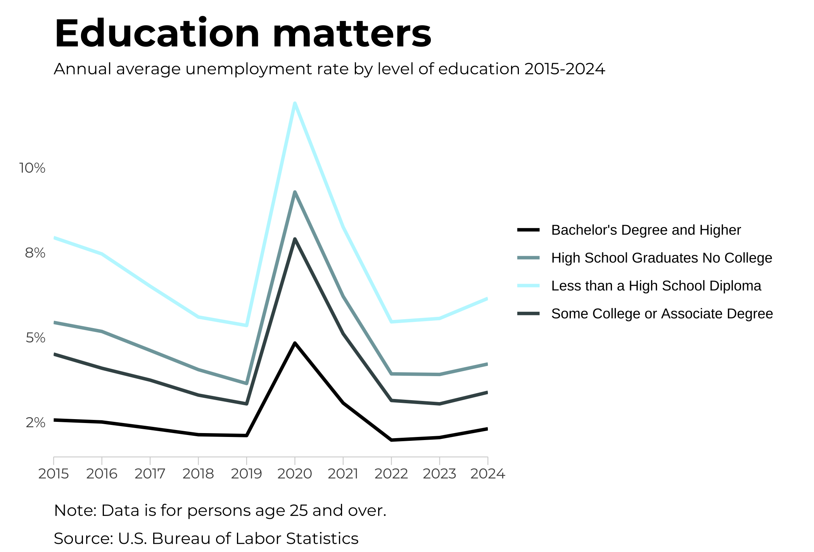

---
output:
  html_document:
    toc: true
    toc_float: true
    theme: united
---

```{r}
library(dplyr)
library(ggplot2)


## Loading Google fonts (https://fonts.google.com/)
sysfonts::font_add_google("Montserrat", "montserrat")

showtext::showtext_auto()

chart_dta <- readr::read_csv("./data.csv") %>% 
  group_by(
    year, 
    seriesname
  ) %>% 
  summarise(
    annual_avg = mean(value)/100
  )

color_scale = c(
  "Less than a High School Diploma" = "#bef7ff",
  "High School Graduates No College" = "#7fa5aa",
  "Some College or Associate Degree" = "#3f5255",
  "Bachelor's Degree and Higher" = "#000000"
)


fig <- chart_dta %>%
  ggplot(aes(year, annual_avg, color = seriesname), size = 2) +
  geom_line(linewidth = 2) +
  scale_color_manual(values = color_scale) +
  scale_y_continuous(
    labels = scales::label_percent(accuracy = 1),
  ) +
  scale_x_continuous(
    expand = expansion(mult = c(0, 0)),
    breaks = c(2015, 2016, 2017, 2018, 2019, 2020, 2021, 2022, 2023, 2024)
  ) +
  ggplot2::theme(
    panel.background = element_rect(fill = 'white', color = 'white'),
    panel.grid.major.x = element_blank(),
    axis.title = element_blank(),
    axis.ticks.x = element_line(color = "lightgray", size = .25),
    axis.ticks.length.x = unit(5, 'pt'),
    axis.ticks.y = element_blank(),
    axis.line.x = element_line(color = "lightgray", size = .25),
    axis.text = element_text(family = 'montserrat', size = 26),
    axis.text.y.left = element_text(family = 'montserrat'),
    plot.margin = margin(l = 12, t = 12, b = 12, r = 20),
    title = element_text(family = 'montserrat', size = 34, face = 'bold'),
    plot.subtitle = element_text(family = 'montserrat', face = 'plain', size = 26, hjust = 0,  vjust = 0),
    plot.caption = element_text(family = 'montserrat', face = 'plain', size = 22, hjust = 0,  vjust = -2, lineheight = .5),
    legend.text = element_text(size = 22),
    legend.key=element_blank(),
    legend.title = element_blank()
  ) +
  guides(color=guide_legend(override.aes=list(fill='white')))+
  labs(
    title = "Education matters", 
    subtitle = "Annual average unemployment rate by level of education 2015-2024",
    x = NULL,
    y = NULL,
    caption = "Note: Data are for persons age 25 and over.\nSource: U.S. Bureau of Labor Statistics"
  )

# Save chart
ggsave("output/line_chart_unemployment.png", height = 4.75)
```
```{r echo=FALSE}

```
